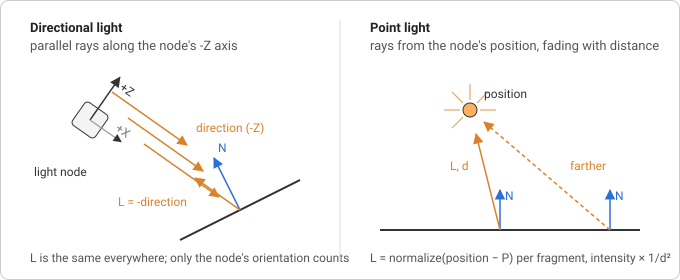

# Lights

A physically based material computes how much light a surface reflects
towards the camera, which is meaningless without knowing how much light
arrives. This step adds the arriving part: three kinds of light source as
nodes in the scene graph, and a fixed set of uniforms through which every
shader can read them. The BRDF that turns arriving light into reflected
light is the next step; here the shading is plain Lambert so the lights
can be seen doing something.

## Three kinds of light

Real light comes from surfaces of every shape and bounces around a room
many times before it reaches the eye. Real-time renderers replace that with
a few idealised sources, each described by a handful of numbers:

- **Ambient light** is a constant colour added to every surface regardless
  of orientation, a stand-in for all the bounced light there is no time to
  simulate. It has no position and no direction.
- **A directional light** is a source so far away that all its rays are
  parallel: the sun. It has a direction and a colour, and it is equally
  strong everywhere in the scene.
- **A point light** radiates from one position in all directions: a light
  bulb. It has a position and a colour, and it gets weaker with distance.

glTF's `KHR_lights_punctual` extension defines exactly the last two (plus a
spot light, a point light restricted to a cone, which is left for later),
and calls them _punctual_ because each is a single point or direction with
no size. That is also why they can give perfectly sharp highlights and
shadows; area lights are a later refinement.



## What a surface receives

For every fragment the shader needs two things per light: the direction
_towards_ the light, `L`, and how much light arrives. Both depend on the
kind of light.

**Directional.** `L` is the same for every fragment: the negated light
direction. The arriving light is just the light's colour.

**Point.** `L` runs from the fragment position `P` to the light position,
`L = normalize(lightPosition − P)`, so it differs per fragment. The
arriving light falls off with distance: the light's energy spreads over a
sphere whose surface grows with `4πd²`, so a fragment at distance `d`
receives `1/d²` of it. This _inverse-square law_ is why point light
intensities are large numbers (a bulb a few units away needs an intensity
of five or ten to look like anything). It never reaches zero, which makes
it impossible to say where a light stops mattering, so glTF adds an
optional `range` and windows the falloff to zero there:

```
attenuation = clamp(1 − (d / range)⁴, 0, 1) / d²
```

The fourth power keeps the window flat until close to the range and then
drops smoothly, so the cutoff does not show as an edge.

**Lambert's cosine law.** How much of the arriving light a surface
actually catches depends on the angle at which it arrives. A beam hitting
a surface head-on covers a small patch; the same beam at a grazing angle
spreads over a larger patch, so each point of it gets less. The ratio is
the cosine of the angle between the surface normal `N` and `L`, which for
unit vectors is their dot product:

```
diffuse = lightColor · max(dot(N, L), 0)
```

The `max` clamps away surfaces facing away from the light; a negative
cosine would mean light arriving from behind the surface. This one product
is the whole of diffuse shading, and it is where every lighting model
starts.

## Which coordinate space

Every vector in that equation has to be in the same space. The built-in
vertex shader already hands the fragment shader `vPosition` and `vNormal`
in _view space_, the camera's own coordinate system, because that is what
`modelViewMatrix` and `normalMatrix` produce. So the renderer converts
each light into view space too, once per frame, and the shader never
transforms anything:

- A directional light's direction is the node's local -Z axis in world
  space. The columns of a transform matrix are the images of the basis
  vectors, so the third column of `worldMatrix` is where local +Z ends up;
  negate it for -Z. Then apply the view matrix as a rotation only (a
  direction has no position, its homogeneous `w` is 0, so the translation
  column does not take part) and normalise, which also removes any scale
  the node carried.
- A point light's position is the fourth column of `worldMatrix`, the
  translation. It is a point, `w = 1`, so the full view matrix applies,
  translation included.

Transforming a direction with the view matrix's rotation is only correct
because the view matrix has no non-uniform scale; a normal in a scaled
space would need the inverse transpose, which is what `normalMatrix` is
for. Cameras are not scaled, so the rotation part will do.

## Colour and intensity

A light has a colour and a scalar intensity, which is easier to animate and
to read from a file than baking brightness into the colour. The shader only
ever needs their product, so the renderer premultiplies:
`uniform = color × intensity`. Light colours are taken as linear RGB (see
[linear and sRGB color](./concepts.md#linear-and-srgb-color)) and the
lighting math runs in linear space; the example shader encodes to sRGB at
the end with `pow(color, 1/2.2)`.

## In magic-pixels

{@link Light} extends {@link Object3D} with a `color` and an `intensity`;
{@link AmbientLight}, {@link DirectionalLight} and {@link PointLight} (with
a `range`, `0` for none) are the three kinds. Being nodes, lights are
positioned, parented, animated and hidden like meshes, and
`prepareScene()` collects the visible ones into `frame.lights` in tree
order. A {@link DirectionalLight} shines along its -Z axis, the same axis a
camera looks along, so `light.lookAt(target)` aims it and a glTF light node
maps onto it without any conversion.

The renderer fills the light uniforms a shader declares, next to the matrix
uniforms and under the same rule (a material uniform of the same name
wins):

| Uniform                        | Type      | Value                                         |
| ------------------------------ | --------- | --------------------------------------------- |
| `ambientLightColor`            | `vec3`    | sum of all ambient lights, colour × intensity |
| `directionalLightDirections[]` | `vec3[]`  | direction each light shines in, view space    |
| `directionalLightColors[]`     | `vec3[]`  | colour × intensity                            |
| `directionalLightCount`        | `int`     | how many entries are filled                   |
| `pointLightPositions[]`        | `vec3[]`  | position in view space                        |
| `pointLightColors[]`           | `vec3[]`  | colour × intensity                            |
| `pointLightRanges[]`           | `float[]` | range, `0` for no cutoff                      |
| `pointLightCount`              | `int`     | how many entries are filled                   |

Two decisions worth knowing. The directional uniform is the direction the
light _shines in_, as in glTF and the Khronos sample viewer, so a shader
negates it to get `L` (three.js stores the opposite). And GLSL uniform
arrays have a compile-time size, so the shader declares how many lights it
can take (`#define MAX_POINT_LIGHTS 4` and arrays of that size) and the
renderer fits the frame's lights to it: unused entries are zero, lights
beyond the size are dropped, and the count is clamped to the shortest
declared array so a loop over it never reads past the end.

Where it lives:

- `src/scene/light.ts`: the four classes.
- `src/scene/renderer.ts`: `prepareScene()` collects lights into
  `Frame.lights`; `NullRenderer` records them as `lastFrame.lights`.
- `src/webgl/light-uniforms.ts`: {@link LightUniforms} and the per-frame
  view-space conversion.
- `src/webgl/webgl2-renderer.ts`: uploads the arrays a shader declares,
  fitted and clamped, through the existing skip-if-unchanged path.
- `src/test-utils/fake-webgl2.ts`: array sizes may now be `#define`d
  names, so shaders in tests can be written like real ones.

## Try it

[Lights](https://learosema.github.io/magic-pixels/examples/08-lights/)
renders a few objects under a circling directional light and an orbiting
point light, with a small unlit sphere parented to the point light so you
can see where it is. The whole shading is the Lambert loop above, in a
fragment shader in the page. Things to change:

- Set the point light's `range` to `3` and watch the falloff window cut it
  off before it reaches the far objects.
- Drop the `-` in `vec3 L = -directionalLightDirections[i]` to see the
  light come from the wrong side.
- Give `ambientLightColor` a strong colour and notice that it flattens
  everything: ambient light has no direction, so it cannot show shape.
- Replace `max(dot(N, L), 0.0)` with `dot(N, L) * 0.5 + 0.5` for the
  "half Lambert" wrap that some stylised renderers use.

## Further reading

- [WebGL2 Fundamentals: Directional lighting](https://webgl2fundamentals.org/webgl/lessons/webgl-3d-lighting-directional.html)
  and [Point lighting](https://webgl2fundamentals.org/webgl/lessons/webgl-3d-lighting-point.html):
  the dot product, the normal matrix and the per-fragment `L`, built up in
  raw WebGL.
- [Learn OpenGL: Basic lighting](https://learnopengl.com/Lighting/Basic-Lighting)
  and [Light casters](https://learnopengl.com/Lighting/Light-casters):
  ambient, diffuse and specular, then directional, point and spot lights
  with their attenuation.
- [Scratchapixel: Lambert's cosine law](https://www.scratchapixel.com/lessons/3d-basic-rendering/introduction-to-shading/diffuse-lambertian-shading.html):
  why the cosine, derived from the area a beam covers.
- [glTF: KHR_lights_punctual](https://github.com/KhronosGroup/glTF/blob/main/extensions/2.0/Khronos/KHR_lights_punctual/README.md):
  the light types, their units, the `range` window, and the -Z convention
  the loader will map onto these classes.
- [Filament: Lighting, punctual lights](https://google.github.io/filament/Filament.html#lighting/directlighting/punctuallights):
  the inverse-square law and the smooth range window, with the reasons for
  each.
- [3D Math Primer, chapter 4: Introduction to matrices](https://gamemath.com/book/matrixintro.html):
  why the columns of a matrix are the transformed basis vectors, the fact
  the -Z extraction relies on.
