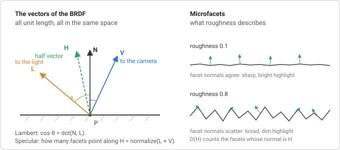

# PBR material

The [lights](./lights.md) step computed how much light arrives at a
surface. This step answers the other half of the question: how much of it
leaves towards the camera. The function that answers it is the BRDF (see
[Rendering concepts](./concepts.md#what-a-brdf-is)), and the glTF
metallic-roughness material is a particular BRDF plus a set of textures
that feed it. `createPbrMaterial()` is that material: the shader every glTF
model will be drawn with, and the first built-in lit material.

## What the surface is made of

A surface is described by a handful of numbers per texel:

- **Base colour** (RGBA, linear): the colour of the diffuse reflection of a
  dielectric, or the colour of the specular reflection of a metal.
- **Metallic** (0 or 1): a dielectric or a metal. The two reflect light in
  completely different ways, so this one number switches between them.
- **Roughness** (0..1): how bumpy the surface is at a scale far below a
  texel. Smooth surfaces mirror, rough surfaces blur.
- **Normal**, **occlusion** and **emissive** maps: a per-texel normal for
  small bumps, a per-texel darkening of the ambient light, and light the
  surface gives off itself.

Everything the BRDF needs is derived from the first three:

```
cDiff = baseColor · (1 − metallic)
f0    = mix(0.04, baseColor, metallic)
α     = roughness²
```

`cDiff` is the diffuse colour: metals have none (light does not enter
metal, it bounces off or is absorbed). `f0` is the reflectance when looking
straight at the surface: for every dielectric it is about 4%, without any
tint, which is why plastic and skin and wood all have white highlights; for
a metal it is the base colour itself, which is why gold highlights are
gold. And `α`, the roughness squared, is the "perceptually linear"
remapping glTF specifies: it makes equal steps of the roughness slider look
like equal steps of blur.

## The BRDF



For every light, the shader has the four unit vectors of the figure: `N`,
`L` (towards the light), `V` (towards the camera) and the _half vector_
`H = normalize(L + V)`. The reflected light is a sum of two terms, weighted
by Lambert's cosine as in the previous step:

```
color += (diffuse + specular) · lightColor · max(dot(N, L), 0)
```

**Diffuse** is the Lambert term from the lights step, in the diffuse
colour, and dimmed by whatever the specular term reflected first
(light that bounced off the surface did not enter it):

```
diffuse = (1 − F) · cDiff
```

**Specular** is the Cook-Torrance microfacet model. The idea: a rough
surface is made of countless tiny mirrors (_microfacets_), each perfectly
smooth but pointing in a slightly different direction. Only the facets
whose normal happens to be `H` reflect light from `L` exactly into `V`. So
the specular term asks three questions and multiplies the answers:

```
specular = F · D · Vis
```

- **D, the normal distribution**: what fraction of the facets point along
  `H`? This is where roughness enters. glTF uses the GGX (Trowbridge-Reitz)
  distribution:

  ```
  D = α² / (π · (dot(N, H)² · (α² − 1) + 1)²)
  ```

  For a smooth surface (small `α`) it is a tall, narrow spike around
  `dot(N, H) = 1`: a small, bright highlight. For a rough one it is low
  and wide: the highlight spreads across the surface and dims. GGX in
  particular has a long tail, which is why real highlights fade out
  softly instead of ending at an edge.

- **Vis, the visibility (or geometry) term**: of the facets that point the
  right way, how many are hidden by their neighbours? Bumps shadow each
  other, from the light's side (_shadowing_) and from the camera's side
  (_masking_), and the rougher the surface and the more grazing the angle,
  the more is lost. The Smith model with GGX facets gives the height
  correlated form

  ```
  Vis = 0.5 / (dot(N, L) · sqrt(dot(N, V)² · (1 − α²) + α²)
              + dot(N, V) · sqrt(dot(N, L)² · (1 − α²) + α²))
  ```

  which already includes the `1 / (4 · dot(N, L) · dot(N, V))` that the
  microfacet model's derivation puts under the whole product. That is why
  it is called `Vis` rather than `G`.

- **F, the Fresnel term**: how much does a single facet reflect? Every
  surface reflects more at grazing angles; a lake is transparent from
  above and a mirror from the shore. Schlick's approximation rises from
  `f0` head-on to full reflection at 90°:

  ```
  F = f0 + (1 − f0) · (1 − dot(V, H))⁵
  ```

  `F` is a colour, because `f0` is, and it is the same `F` that dims the
  diffuse term above. This one line is what makes metals look like metal:
  their `f0` is their base colour, and everything they reflect is tinted
  by it.

That is the entire lighting model. There are no shininess exponents and no
specular colours to tune; roughness and metallic are the only knobs, and
both mean something you could measure.

### Where the π went

The specification's BRDF has a `1/π` in the diffuse term (`cDiff / π`)
and one inside `D`. They are there so that a surface never reflects more
energy than it receives: the Lambert BRDF integrated over the hemisphere
comes out as exactly `cDiff`. The magic-pixels shader leaves both out.
That is the same as multiplying every light's intensity by π, and it means
a light of intensity 1 makes a white diffuse surface facing it exactly
white, which is what the [lights](./lights.md) page assumed and what makes
intensities easy to pick. The glTF loader will divide the intensities of
`KHR_lights_punctual` lights by π when it maps them, so files render as
the specification intends.

### Ambient light, occlusion and emission

An ambient light has no direction, so the BRDF above cannot be applied to
it; it stands for a uniform environment shining from everywhere. Such an
environment reflects diffusely with `cDiff`, and specularly with roughly
`f0`, the average reflectance, so the shader adds:

```
color += ambientLightColor · (cDiff + f0) · occlusion
```

This is the crude stand-in for image-based lighting, which would integrate
the BRDF over a real environment map and is a later milestone. The
occlusion map only darkens this term: a crevice is hidden from the
environment, but not from a light that shines straight into it. Emission is
added last, after all lighting, because it is light the surface makes
itself.

### Normal mapping

A normal map stores normals in _tangent space_: `x` along the direction
in which the texture's `u` grows across the surface, `y` towards the top
of the image (towards `v = 0`, since the first image row is `v = 0`), `z`
along the surface normal. To use
the sampled normal the shader needs those three axes in view space, the
TBN matrix, and multiplies:

```
n = normalize(mat3(T, B, N) · (texel · 2 − 1))
```

`N` is the interpolated vertex normal. `T`, the tangent, either comes from
a `tangent` attribute (glTF stores one per vertex, with the handedness of
`B` in its `w`), or the shader reconstructs it from how the texture
coordinates change between neighbouring pixels: `dFdx` and `dFdy` give
the change of position and of `uv` across one screen pixel, and solving
`dp = T · du + B · dv` for `T` yields the direction of growing `u`. `B` is
then `cross(N, T)`, times `w` if there is one.

### Output

All of the above happens in linear light. The last line encodes the
result for the sRGB display, with the exact transfer curve (a linear
segment near black, a `1/2.4` power above) rather than the `pow(1/2.2)`
approximation of the earlier examples. The alpha handling depends on the
material's alpha mode: `OPAQUE` writes 1, `MASK` discards fragments below
the cutoff and writes 1, `BLEND` writes the base colour's alpha and lets
the render state from the [material render state](./material-render-state.md)
step composite it.

The conversion is the one thing a scene drawn into a render target must not
do: a later pass converts once, after tone mapping. The `linearOutput` option
skips it; see [Tone mapping](../rendering/tone-mapping.md).

## In magic-pixels

`createPbrMaterial(options)` returns an ordinary {@link Material} whose
sources are `src/shaders/pbr.vert` and `pbr.frag`. Every option is a glTF
material property of the same name: the factors become uniforms
(`baseColorFactor`, `metallicFactor`, `roughnessFactor`, `emissiveFactor`,
`normalScale`, `occlusionStrength`, `alphaCutoff`) that can be changed
at any time; the maps (`baseColorMap`, `metallicRoughnessMap`,
`normalMap`, `occlusionMap`, `emissiveMap`) are {@link Texture} uniforms,
each optionally with the texture coordinate set to sample (`uv` or `uv1`,
see {@link PbrMap}). `alphaMode` and `doubleSided` set `transparent` and
`side`; `unlit` gives the `KHR_materials_unlit` variant, base colour (factor, map and
vertex colours) with no lighting, the way to show baked-in lighting;
`linearOutput` writes the linear colour without the sRGB conversion, for
rendering into a float render target.
The material reads the lights through the built-in light uniforms of the
previous step. See {@link PbrMaterialOptions} for the whole list.

Two decisions worth knowing:

- **Map presence is decided at creation, not per draw.** A GLSL sampler
  with no texture bound reads texture unit 0, whatever happens to be there,
  so "no normal map" cannot be a uniform. `createPbrMaterial()` inserts a
  block of `#define`s after the `#version` line (`HAS_NORMAL_MAP`,
  `NORMAL_UV vUv1`, `HAS_TANGENT`, `ALPHA_MASK`, ...) and the shader
  compiles only the code for the maps and attributes that exist. Adding a
  map means creating a new material.
- **Programs are cached by source.** Materials with the same defines
  produce byte-identical sources, so the renderer now keys its program
  cache by the source pair and shares one program between them, keeping
  one uniform state cache per program. A model with forty materials that
  all use a base colour map compiles one program, not forty.

Where it lives:

- `src/shaders/pbr.vert`: hands position, normal, `uv`, and optionally
  `uv1`, `color` and `tangent` to the fragment shader in view space.
- `src/shaders/pbr.frag`: the BRDF above, the normal mapping, the ambient
  and emissive terms and the sRGB output.
- `src/scene/material.ts`: `createPbrMaterial()`, {@link PbrMaterialOptions}
  and {@link PbrMap}; the option to define mapping and the uniforms.
- `src/scene/constants.ts`: the {@link AlphaMode} string union.
- `src/webgl/webgl2-renderer.ts`: the program cache keyed by shader
  source, with the uniform state moved next to the program.

## Try it

[PBR material](https://learosema.github.io/magic-pixels/examples/09-pbr-material/)
renders a grid of spheres, roughness from left to right and metalness from
front to back, on a floor with a generated checker base colour map and a
normal map that uses the derivative tangent frame, under a circling sun and
an orbiting point light. Things to change:

- Set every sphere's `metallicFactor` to 1 and remove the ambient light:
  metals reflect nothing but the lights, so they go black between the
  highlights. That is the gap image-based lighting will fill.
- Replace `cDiff · (1 − F)` with plain `cDiff` in the shader and look at
  the smooth spheres at a grazing angle: they get brighter than the light
  allows, because the specular and diffuse terms now both count the same
  light.
- Set `normalScale` of the floor to `-1` to turn the bumps into dents, or
  to `3` to see why exaggerated normal maps look wrong: the normals lean
  further than any real bump could.
- Give the floor `alphaMode: 'mask'` and a base colour map with holes in
  its alpha channel.

## Further reading

- [glTF specification, appendix B: BRDF implementation](https://registry.khronos.org/glTF/specs/2.0/glTF-2.0.html#appendix-b-brdf-implementation):
  the exact model this shader implements, term by term, with the same
  names.
- [Khronos glTF sample viewer: `brdf.glsl`](https://github.com/KhronosGroup/glTF-Sample-Viewer/blob/main/source/Renderer/shaders/brdf.glsl)
  and [`pbr.frag`](https://github.com/KhronosGroup/glTF-Sample-Viewer/blob/main/source/Renderer/shaders/pbr.frag):
  the reference implementation `pbr.frag` follows.
- [Learn OpenGL: PBR theory](https://learnopengl.com/PBR/Theory) and
  [PBR lighting](https://learnopengl.com/PBR/Lighting): the microfacet
  model, energy conservation and each of D, G and F with pictures, then
  the same shader written from scratch.
- [Filament: Physically based rendering](https://google.github.io/filament/Filament.html#materialsystem):
  the derivations behind the terms, the height-correlated Smith visibility
  function, and the roughness remapping.
- [Naty Hoffman: Physics and math of shading](https://blog.selfshadow.com/publications/s2013-shading-course/hoffman/s2013_pbs_physics_math_notes.pdf):
  the SIGGRAPH course notes that most real-time PBR builds on.
- [Christian Schüler: Followup: Normal mapping without precomputed tangents](http://www.thetenthplanet.de/archives/1180):
  the screen-space derivative tangent frame.
- [Learn OpenGL: Normal mapping](https://learnopengl.com/Advanced-Lighting/Normal-Mapping):
  tangent space, the TBN matrix and why tangents are needed.
- [Wikipedia: sRGB](<https://en.wikipedia.org/wiki/SRGB#Transfer_function_(%22gamma%22)>):
  the exact transfer function the output step uses.
