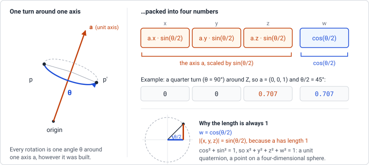

# Quaternions

glTF stores the rotation of every node as four numbers `[x, y, z, w]`, a
_quaternion_, and every rotation animation as a list of them. This page
explains what those four numbers mean and why they beat three angles.

## Why not Euler angles

`Object3D.rotation` is three Euler angles: rotate around X, then around the
rotated Y, then around the rotated Z. Easy to type, but two things go wrong:

- **Gimbal lock.** Rotate 90° around Y and the X and Z axes line up. A turn
  around one is now the same as a turn around the other, one degree of
  freedom is gone, and the angles describing a nearby orientation can jump.
- **No clean interpolation.** An animation stores an orientation at a few
  key frames and needs the ones in between. Interpolating the three angles
  separately does not take the shortest path and does not move at constant
  speed: the object wobbles.

A quaternion has neither problem, which is why glTF uses them.

## What the four numbers mean

Any rotation, however it was built, is one turn by some angle `θ` around
some axis `a` (Euler's rotation theorem). A quaternion stores that turn,
with the axis scaled by the sine of _half_ the angle and the cosine of half
the angle as a fourth number `w`:



```
x = a.x · sin(θ/2)
y = a.y · sin(θ/2)
z = a.z · sin(θ/2)
w = cos(θ/2)
```

Some values to get a feel for it:

| Rotation                    | axis `a`    | `θ/2` | `(x, y, z, w)`          |
| --------------------------- | ----------- | ----- | ----------------------- |
| none (identity)             | any         | 0°    | `(0, 0, 0, 1)`          |
| quarter turn around Z       | `(0, 0, 1)` | 45°   | `(0, 0, 0.707, 0.707)`  |
| half turn around Y          | `(0, 1, 0)` | 90°   | `(0, 1, 0, 0)`          |
| quarter turn around Z, back | `(0, 0, 1)` | -45°  | `(0, 0, -0.707, 0.707)` |

The identity has no axis part and `w = 1`. As the angle grows, the axis
part grows and `w` shrinks; at a half turn `w` is 0. Turning the other way
flips the sign of the axis part.

Two facts follow:

- Since `sin² + cos² = 1`, a rotation quaternion always has length 1. After
  many multiplications rounding makes it drift; `normalize()` fixes that.
- `q` and `-q` are the same rotation (a turn by `θ + 360°`). So two
  quaternions can be different numbers for the same orientation, which is
  why rotations are compared by what they do, not by their components.

**Why half the angle?** A quaternion rotates a point `p` as `q · p · q⁻¹`:
`q` is applied on one side and its inverse on the other, and each side
contributes half the turn. That is the one formula on this page you can
take on trust; the rest follows from it.

## Composing rotations

Multiplying two quaternions gives the quaternion of the combined rotation,
in the same order as matrices: `a × b` applies `b` first, then `a`. The
product (the _Hamilton product_) is, with `v` the `(x, y, z)` part of each:

```
vector part:  a.w · bv + b.w · av + av × bv
scalar part:  a.w · b.w − av · bv
```

The cross product is why the order matters, just as for matrices.

The inverse of a unit quaternion is its _conjugate_ `(-x, -y, -z, w)`: same
axis, opposite angle. And a unit quaternion turns into a rotation matrix
with nine multiplications and no trigonometry, which is how it reaches the
GPU:

```
| 1 − 2(y² + z²)     2(xy − wz)       2(xz + wy)   |
|   2(xy + wz)     1 − 2(x² + z²)     2(yz − wx)   |
|   2(xz − wy)       2(yz + wx)     1 − 2(x² + y²) |
```

Check it with the quarter turn around Z, `(0, 0, s, s)` with `s² = 0.5`: the
first column, the image of the X axis, comes out as `(0, 1, 0)`. X went to
Y, as it should.

Euler XYZ angles are three such turns in a row, so the quaternion for them
is `qx × qy × qz`. Going back from a quaternion to Euler angles works, but
the angles come back wrapped into `-π..π`: `(0, 0, 4)` becomes
`(0, 0, 4 − 2π)`, the same rotation.

## Slerp

Unit quaternions are points on a four-dimensional sphere, and _spherical
linear interpolation_ moves between two of them along the great circle
through both. With `Ω` the angle between `a` and `b` (`cos Ω = a · b`):

```
slerp(a, b, t) = a · sin((1 − t)·Ω) / sin Ω + b · sin(t·Ω) / sin Ω
```

Equal steps in `t` are equal steps in angle, so the rotation runs at constant
speed and takes the shortest way round. One catch: because `b` and `-b` are
the same rotation, one of them lies on the far side of the sphere. If
`a · b < 0`, `b` is negated first; otherwise slerp would turn 350° instead
of 10° the other way.

## In magic-pixels

{@link Quaternion} has `x, y, z, w`, in-place methods that return `this`,
and the constructors `fromAxisAngle`, `fromEuler`, `fromRotationMatrix` and
`fromArray` (the glTF layout). `multiply`, `invert`, `normalize` and
`slerp` are the operations above; `toEuler` goes the other way.

Every {@link Object3D} carries its rotation twice: `quaternion` is what the
local matrix is built from, `rotation` is the same rotation as Euler
angles. Write to whichever is convenient. Before each render the scene
graph compares both with their values at the last update and converts the
one that changed into the other; if both changed, the quaternion wins.
`lookAt()` and `setRotationFromMatrix()` set both at once.

{@link Mat4.compose} accepts a quaternion or Euler angles, and
`Mat4.rotationFromQuaternion(q)` is the matrix above.

Where it lives:

- `src/utils/quaternion.ts`: the {@link Quaternion} class and its tests.
- `src/utils/mat4.ts`: `compose` takes `Quaternion | Vector`;
  `rotationFromQuaternion` / `setRotationFromQuaternion`.
- `src/scene/object3d.ts`: the `quaternion` field, the sync in
  `updateLocalMatrix()`, and `setRotationFromMatrix()` writing the
  quaternion first.

## Try it

Replace the usual `rotation.y += dt` in a spinning-cube demo with a slerp
between two orientations:

```js
const from = Quaternion.fromEuler(new Vector(0, 0, 0));
const to = Quaternion.fromAxisAngle(new Vector(1, 1, 0).normalized, Math.PI);
let t = 0;

function frame(dt) {
  t = (t + dt * 0.25) % 1;
  cube.quaternion.slerpQuaternions(from, to, t);
  renderer.render(scene, camera);
}
```

The cube turns half way around a tilted axis and snaps back. Log
`cube.rotation` once a second and watch three Euler angles do something far
less tidy to describe the same motion. For gimbal lock, set
`cube.rotation.y = Math.PI / 2` and then change `rotation.x` and
`rotation.z`: both turn the cube around the same world axis.

## Further reading

- [Ben Eater and Grant Sanderson: Visualizing quaternions](https://eater.net/quaternions):
  an interactive explanation of what the four numbers are, with the
  stereographic projection that makes the four-dimensional sphere visible.
  Start here.
- [3D Math Primer, chapter 8: Rotation in three dimensions](https://gamemath.com/book/orient.html):
  Euler angles, matrices, axis-angle and quaternions side by side, with all
  the conversions worked out on paper.
- [Euclidean Space: Quaternions](https://www.euclideanspace.com/maths/algebra/realNormedAlgebra/quaternions/index.htm):
  the classic reference for the matrix-to-quaternion conversion and its
  n-umerical corner cases.
- [Ken Shoemake: Animating rotation with quaternion curves (1985)](https://dl.acm.org/doi/10.1145/325165.325242):
  the SIGGRAPH paper that brought quaternions to graphics and coined
  "slerp". Short and readable.
- [glTF 2.0 specification: Transformations](https://registry.khronos.org/glTF/specs/2.0/glTF-2.0.html#transformations):
  how a node's `rotation` is stored and combined with translation and scale.
- [three.js: Quaternion](https://threejs.org/docs/#api/en/math/Quaternion):
  the API this class follows.
