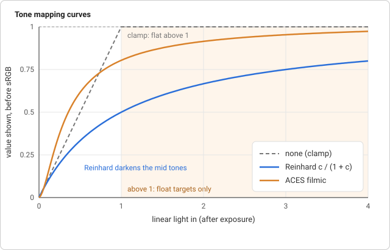
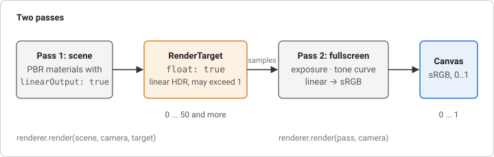

# Tone mapping

Lighting is arithmetic on light. Add a bright lamp to a shiny surface and
the sum can be 5, or 50. A display can show values from 0 to 1 and nothing
more. What happens in between is a design decision, and this page is about
making it on purpose.

## Linear in, sRGB out

Light adds up in **linear** units: twice the photons is twice the number.
Displays are not linear: a pixel value of 0.5 is not half as bright as 1.0,
because the sRGB encoding spends its precision where eyes are sensitive.
The rule from [linear and sRGB colour](../gltf/concepts.md#linear-and-srgb-color)
is to do all maths in linear space and convert exactly once, at the very
end.

That has a consequence for an 8-bit framebuffer. If the shader converts to
sRGB before storing, the stored picture is no longer linear and cannot be
processed properly afterwards (blurring sRGB values darkens edges). If it
does not convert, an 8-bit texture stores 256 linear steps, far too coarse
in the shadows, and it clips everything above 1.

## HDR and tone mapping

The fix is a render target whose format has more room: half float, 16 bits
per channel that can hold any value from tiny to 65504. Nothing is lost by
a lamp that adds up to 5; it is stored as 5. This is **high dynamic range**
(HDR). The extra range is only useful if something maps it down for the
display at the end, and that is **tone mapping**: a curve that takes any
non-negative linear value and returns one in 0..1.

Two curves are implemented:

- **Reinhard**, `c / (1 + c)`. Simple to reason about: 0 stays 0, 1 becomes
  0.5, and large values approach 1 without ever reaching it. The price is
  a flat picture, everything is pulled towards grey.
- **ACES filmic**, a fit by Krzysztof Narkowicz of the curve the film
  industry uses:

  ```
  (c · (2.51c + 0.03)) / (c · (2.43c + 0.59) + 0.14)
  ```

  It has an S shape: a toe that deepens the shadows, a straight middle that
  keeps contrast, and a shoulder that rolls the highlights off gently. Colours
  in the bright parts keep their hue instead of clipping to white.



**Exposure** comes before the curve: the colour is multiplied by a number,
like the aperture and shutter of a camera. Doubling it is one _stop_. It is a
plain uniform, so a slider changes the picture without touching the scene.

## A pass that draws a picture

Applying the curve to every pixel of a finished image is a **fullscreen
pass**: draw a shape that covers the whole screen and let the fragment shader
sample the previous result at its own position. The shape is one triangle,
larger than the screen, with the corners `(-1, -1)`, `(3, -1)` and `(-1, 3)` in
clip space. The GPU clips it to the screen, which needs no shared vertices, so
there is no diagonal seam where the two triangles of a quad would meet. The
vertex shader turns the position into texture coordinates,
`vUv = position · 0.5 + 0.5`, and ignores every matrix.



## In magic-pixels

```js
const target = new RenderTarget(canvas.width, canvas.height, { float: true });

const material = createPbrMaterial({ linearOutput: true /* ... */ });
const pass = new Scene();
pass.add(
  createFullscreenMesh(
    createToneMapMaterial({ map: target.colorAttachment, exposure: 1 })
  )
);

renderer.render(scene, camera, target); // linear HDR into the target
renderer.render(pass, camera); // tone map to the canvas
```

- `createPbrMaterial({ linearOutput: true })` skips the sRGB conversion at
  the end of the PBR shader (the default keeps it, so a scene drawn straight
  to the canvas is unchanged). The scene must not be converted twice.
- {@link createToneMapMaterial} reads `map`, multiplies by the `exposure`
  uniform, applies the curve (a {@link ToneMapping}, `'aces'` by default) and
  converts to sRGB. The curve is baked into the shader source with a
  `#define`, like the maps of the PBR material.
- {@link createFullscreenMesh} builds the triangle. Any other pass, a blur or
  a colour grade, is a {@link createFullscreenMaterial} with your own fragment
  shader reading `vUv`; the material turns depth testing and depth writes off,
  because a pass just overwrites every pixel. The camera you pass to `render`
  does not matter.

Where it lives:

- `src/shaders/fullscreen.vert`, `src/shaders/tonemap.frag`: the pass.
- `src/scene/fullscreen.ts`: {@link createFullscreenMesh}.
- `src/scene/material.ts`: {@link createFullscreenMaterial},
  {@link createToneMapMaterial} and the `linearOutput` option.
- `src/shaders/pbr.frag`: the sRGB conversion behind the `LINEAR_OUTPUT`
  define.

## Try it

[Render targets](https://learosema.github.io/magic-pixels/examples/11-render-targets/)
lights a scene brighter than the display can show. Switch the curve to
_none_ and the highlights clip to white; drag the exposure slider with ACES
on and watch the highlights roll off. Then add a second fullscreen pass of
your own between the scene and the tone mapping: a `createFullscreenMaterial`
that darkens the corners, drawn into a second target (ping-pong).

## Further reading

- [Learn OpenGL: HDR](https://learnopengl.com/Advanced-Lighting/HDR): float
  framebuffers, Reinhard, and exposure.
- [Learn OpenGL: Gamma correction](https://learnopengl.com/Advanced-Lighting/Gamma-Correction):
  why the last step converts to sRGB.
- [Krzysztof Narkowicz: ACES filmic tone mapping curve](https://knarkowicz.wordpress.com/2016/01/06/aces-filmic-tone-mapping-curve/):
  where the fit above comes from.
- [Wikipedia: Tone mapping](https://en.wikipedia.org/wiki/Tone_mapping):
  the general problem and the families of curves.
